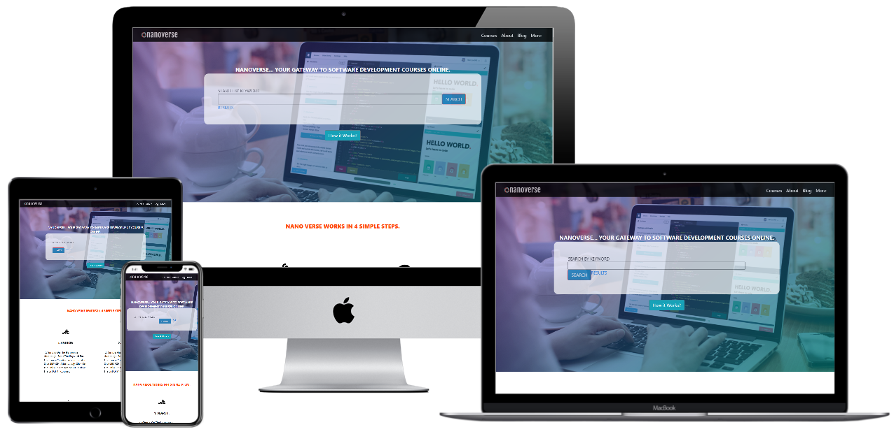
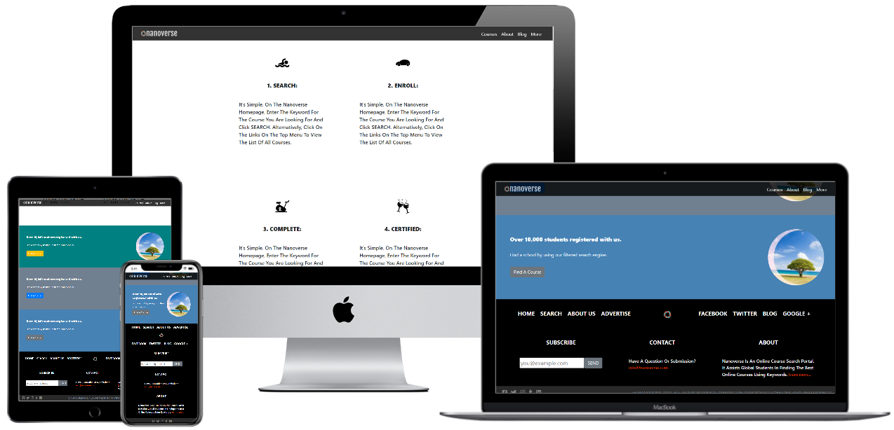
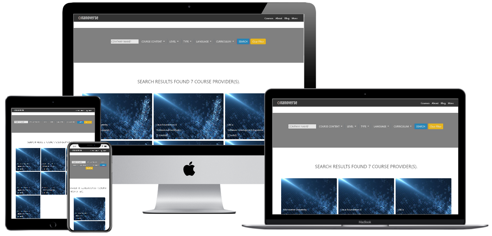
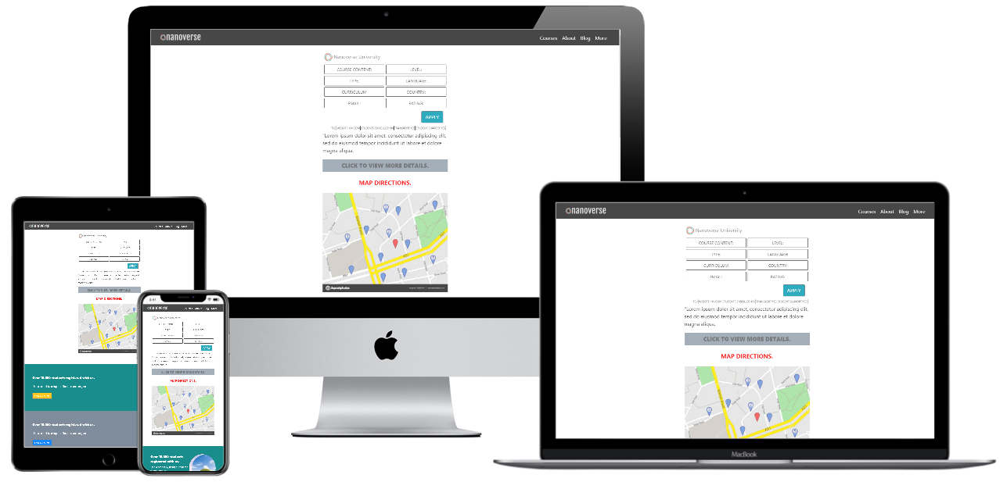

# Project Name: DIRECTORY SEARCH AND LISTING - WEBSITE LAYOUT

Visitors are expected to use this as a Directory service website to shortlist matching schools to take Software and IT related courses.
The website aims to be a layout concept for a directory search and results listing page for finding information. I have implemented the concept for Online Software Development Courses & Results list shortlisted/filtered online schools that are detailed further when you view one result card. There are placeholders to include ratings, ranking, locations, application process, website, contact info & Map gps location.

## CAPSTONE PROJECT - BUILD A COMPLETE HTML5 & CSS3 WEBSITE

Beaufitul responsive and mobile first web-page design is the future. With mobile devices and multiple size and input devices dominating and growing exponentially, this is going to be the front-end revolution. The mockups show how lovely the designs scale to work on multiple devices with varying width and viewports.

## Skills Revived & Learned:

- Versioning & best coding practices, Github Flow.
- HTML5, CSS3 elements, semantics, features etc.
- Linter - install & fix errors
- Collaborative learning, being patient, helping each other succeed.
- Self Monitoring & reliable project deliverables on due time, being focused, accountable.
- Ability to work independently and ask for help after due self research when needed.

### Learning Goals:

- Version Control, Github Flow
- Application HTML5, CSS3, Bootstrap.
- Position, Flex, Grid, Floats, RWD

## Built With

- Major languages: HTML5, CSS3
- Frameworks: Bootstrap, Github flow
- Technologies used: Responsive Web Design

## Steps to Clone/Customize the Website Template

- Download/Clone/Fork the Repo
- Double Click the index.html and choose a default browser if it your Operating System does not automatically choose one. (Usually Chrome, Edge, Firefox etc)

### To continue customizing:

- index.html - is the main and first page that your website visitors will view
- results.html - you have filters to customize your search results & this is also is where the SEARCH results based on the KEYWORD enterd on the home page are listed
- course.html - when you select a preferred search result you can view additional detail about the course, the course provider, contact and location etc.

### To modify the Theme & Colors/Fonts

- index.html - stylex.css lists the landing page CSS
- results.html - results.css lists the landing page CSS
- course.html - course.css lists the landing page CSS

## Live Demo

[Live Demo Link](https://smy5152.github.io/nanoverse/)

## Authors

👤 **Shabbir**

- GitHub: [@smy5152](https://github.com/smy5152)
- Twitter: [@smy5152](https://twitter.com/smy5152)
- LinkedIn: [Shabbir Yamani](https://www.linkedin.com/in/shabbirmyamani/)

## Show your support

Give a ⭐️ if you like this project!

## Acknowledgments

- Hat tip to anyone whose code was used
- Inspiration
- Learning
- You can access all the design info (layouts) in this link:
  [https://www.behance.net/gallery/25563385/PatashuleKE](https://www.behance.net/gallery/25563385/PatashuleKE)
- Design idea by [Mathew Njuguna and others on Behance](https://www.behance.net/mathewnjuguna)

## 📝 License

This project is [MIT](./LICENSE) licensed.
